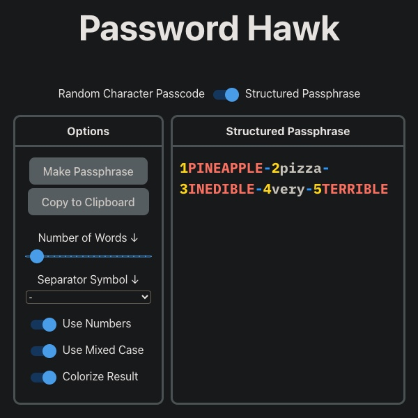

# Password Hawk

Password Hawk is a password generator for different two styles: passphrases and passcodes.

The goal of Password Hawk is to generate passwords, load quick, look good, swiftly return results, have relatively low control complexity.

## Technical Stuff
### Frameworks
This site was built using ReactJS, Vite, TypeScript (not really), and Material UI.

### How our passwords are generated
The most secure passwords are randomly generated. The following shows the logic behind how our passphrases and passcodes are randomly generated, as random as JavaScript's `Math.Random()` function can possibly be. This is being shared for transparency.
#### Passphrases
The total number of words in our word bank is just over 118,000 words. Our words are divided into their own arrays, corresponding to their length. So we start with 5 arrays of words, each array containing words of 4, 5, 6, 7, or 8 letters in length. When the passcode generator is called, a number is randomly chosen corresponding to each array:

    // Return a random int from 4 to 8 (both inclusive)
    function randomValue() {
      const result = Math.floor(Math.random() * 5) + 4;
      return result;
    }

Now that we have a chosen array, we randomly choose an element in that array, that will be a word for our passphrase:

    const randomizer = (source: array) => {
      const ceiling = source.length;
      const randomValue = Math.floor(Math.random() * ceiling);
      return source[randomValue];
    }

If the mixed case option is selected (it's on be default), each word then has a 50/50 chance of being cast to uppercase.

Now that we have a randomly chosen word, of a randomly chosen length, we prepend a randomly chosen number (0 through 9), then append the separator symbol (default is dash "-"), then rinse and repeat for the total number of desired words (default is 5 words). These results then get pushed to a state variable, and that state variable gets displayed.

That's how our passphrases are randomly generated.

#### Passcodes
Passcodes start with 3 arrays, first array containing the 26 letters of the English alphabet, the second containing the numbers 0 through 9, the last containing 14 symbols.

When the "Use Numbers" toggle is selected, the array of numbers is added to the array of letters, same with the "Use Symbols" option and its corresponding array of symbols. That array then becomes our source array (`theList` in the last code block). When the passcode generator function is called, it randomly picks an element (letter, number, or symbol) from the source array to be our character. If "Use Mixed Case" is selected, the function will randomly cast the selected character to upper or lower case (50/50 chance, even for characters that don't have an uppercase variant).

    // Random Character Generator, randomly return upper or lower case character
    const randomLetterGenerator = (source) => {
      let result;
    
      // Picks a character, any character.
      const resultUncased = () => {
        const selector = Math.floor(Math.random() * source.length);
        return source[selector];
      }
    
      // Use mixed case or only lowercase
      if (useMixedCase === true) {
        if (Math.random() > .5) {
          result = resultUncased().toUpperCase()
        } else {
          result = resultUncased()
        }
      } else {
        result = resultUncased().toLowerCase()
      }
      return result;
    }

This function will rinse and repeat the amount of times determined by "Character Count" (default is 20), push each character to a state variable, then display that state variable.

    // Generates the password (stores a list of random characters to the setPassword hook)
    const passwordGenerator = (flag) => {
      let result = [];
      for (let i = 0; i < passwordLength; i++) {
        result.push(randomLetterGenerator(theList))
      }
      setPassword(result);
      if (flag) { return result.join("") }
    }

Hope this answers any questions about how our results are generated. 
